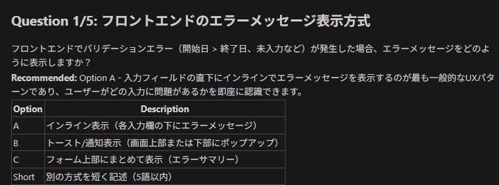
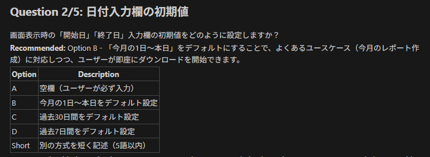
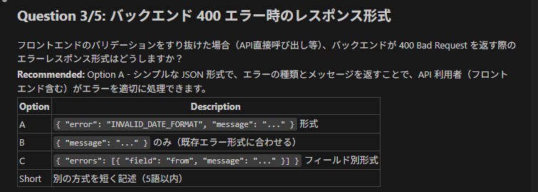
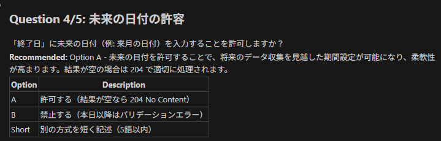

# spec-kitの導入。

```bash
uv tool install specify-cli --from git+https://github.com/github/spec-kit.git
```

`specify-cli==0.0.22`をインストール。

```bash
specify init .
specify check
```

specify checkの結果。 ready


# claude で作業開始

今回はpowershellで起動

```
claude
```

## プロジェクト憲法を書く

```
/speckit.constitution 可読性を重視する。 テストは必須。 シンプルな設計を優先し、過剰な抽象化は避ける。 ユーザー体験を第一に考える。
```

## STEP 5：仕様を書く（技術の話はしない）

```
> /speckit.specify
複数のアプリに対する利用者の感想を収集するためのウェブフォームを作成したい。

このフォームは、特定のアプリごとに異なるURLからアクセスされる。
例えば、/app1/form や /app2/form のように、アプリごとにパスが分かれている。
フォームの入力項目自体は、どのアプリでも共通である。

利用者は、フォーム上で以下の情報を入力できる。
- 名前
- 評価（1〜3の3段階）
- 自由記述欄

これらの項目はすべて任意とし、未入力のまま送信することも可能とする。

フォームは、どのアプリに対する感想を入力しているかが利用者に分かるよう、
アプリごとに表示されるタイトルや文言が適切に変化する。

フォームの回答結果は、管理者がCSV形式でダウンロードできるようにしたい。

将来的に入力項目が追加される可能性がある。
その場合、過去の回答データについても、
追加された項目の列を含んだCSVを出力し、
当時存在しなかった項目については空白として扱われること。
```

# clarifyへの回答(追加で説明した部分)

```
A - 評価は 任意項目.現在は 1〜3 だが、将来 4 段階以上に変わる可能性がある.厳密なバリデーションより データ収集の柔軟性を優先したい.UI は誘導するが、保存時は縛らない
```

# speckit.planで計画を立ててもらう

```
/speckit.plan
This project is an MVP.

Implement a single-page application hosted on Amazon S3 and delivered via CloudFront.
Backend APIs must be routed through Amazon API Gateway and implemented with AWS Lambda.
Do not use Lambda Function URLs or ALB.

All infrastructure must be defined using AWS CDK (TypeScript).

The feedback form UI should be implemented using SurveyJS.
The form must support both Japanese and English.
Form definitions should be data-driven and shared across applications.

The same form is used for multiple applications, distinguished by URL paths such as /app1/form.
Applications are registered and managed via configuration or data storage outside the web UI.

Form fields are optional and may increase over time.
The data model must support schema evolution without data migration.
Validation should guide users in the UI, but backend storage must accept any values.

Collected responses must be downloadable as CSV (UTF-8 with BOM).
When new fields are added, CSV exports must include the new columns and leave blank values for older records.

Do not introduce authentication, admin UI, or premature optimization.
Prioritize simplicity, clarity, and long-term maintainability.
Write the output in Japanese.


```

# /speckit.tasks でタスク一覧を作ってもらう

```
/speckit.tasks
Generate an MVP-focused task list based strictly on the existing plan.md and related documents.
Group tasks by infrastructure, backend, and frontend.
Do not introduce new features or refactorings.
Write the output in Japanese.

```

# /speckit.implements で実装開始

## package.jsonの更新

claudeが準備したpackage.jsonのライブラリのバージョンが古いので更新した

## lint設定

これは個人的な好み。
フロントエンド。

```
$ bun i -D @eslint/eslintrc @eslint/js eslint eslint-config-prettier eslint-import-resolver-typescript eslint-plugin-import eslint-plugin-react-hooks eslint-plugin-react-refresh  eslint-plugin-sonarjs eslint-plugin-unused-imports globals typescript-eslint
```

バックエンド

```

$ bun i -D @eslint/eslintrc @eslint/js eslint eslint-config-prettier eslint-import-resolver-typescript eslint-plugin-import  eslint-plugin-sonarjs eslint-plugin-unused-imports globals typescript-eslint
```

## CDK動作確認

infrastructureディレクトリで下記。

```
npm run synth
aws login
npm run deploy
```

フロントエンドデプロイ確認

https://d3nw9s12usdo3l.cloudfront.net/

バックエンドデプロイ確認
https://kiuzitkug5.execute-api.ap-northeast-1.amazonaws.com/prod/api/responses/csv

https://d3nw9s12usdo3l.cloudfront.net/api/responses/csv

## フロントエンド動作確認(開発)

http://localhost:5173/app1/form

## 動作確認

https://d3nw9s12usdo3l.cloudfront.net/app1/form

## バックエンド動作確認 (開発)

```
winget install -e --id Amazon.SAM-CLI
```

ローカルのDynamodbの起動

```
docker-compose up
```

ローカルのAPIGatewayの起動

```
$ npm run local-api
```

## E2Eテスト

Playwrightブラウザをインストール

```
cd e2e && npx playwright install
```

## CSVダウンロード

https://d3nw9s12usdo3l.cloudfront.net/admin

# CSVを期間を指定して落とせるようにする

## apec-kit から追加

プロンプト

```
spec-kit add
CSV ダウンロード API に日付範囲による絞り込みを追加したい

クエリパラメータ from と to を追加

フォーマットは YYYY-MM-DD

from はその日の 00:00:00 から

to はその日の 23:59:59.999 までを含める

to=2026-01-03 の場合、2026-01-03 の最終時刻までのデータを必ず含める

CSV の内容はこの期間条件でフィルタされる

パラメータ未指定時は従来通り全件
```

## フロントエンドのことを言及していなかったので /speckit.clarify で修正

```
/speckit.clarify
フロントエンドでの日付範囲入力について仕様を明確化したい。

- CSV ダウンロード画面に「開始日」「終了日」の入力欄を追加する
- 入力形式は YYYY-MM-DD
- フロントエンドでは未指定を許容しない (APIは未指定時は従来通り全件対象)
- 開始日 > 終了日の場合はエラー表示する
- フロントエンドで基本的な入力バリデーションを行う
- バックエンド側でも同様のバリデーションを行う（二重防御）
- 入力された日付は UTC として扱う
- 開始日または終了日が未入力の場合、CSV ダウンロード操作自体を無効化する
- バリデーションエラー時は、API リクエストは送信しない

UI 挙動とエラーメッセージの責務分担を明確にしたい。

```

## clarify で ClaudeがCSV期間追加の詳細を聞いてきたので回答







## /speckit.plan で期間追加計画を立てる

プロンプト

```
/speckit.plan
この仕様（specs/001-csv-date-filter/spec.md）に基づいて実装計画を作成してください。

以下を満たす形で計画を提示してください。

- フロントエンド / バックエンド / テストを明確に分ける
- 既存 CSV ダウンロード機能への変更点を明示する
- フロントエンドは FR-015（初期値）, FR-016（204 時の通知）を必ず反映する
- バックエンドは from/to の UTC 境界処理とバリデーションを含める
- FR-007a のエラーレスポンス形式を前提とする
- Edge Cases（未来日付・開始日 > 終了日）を考慮する
- 実装順序と依存関係が分かる段階的タスク分解にする
- 各タスクに対応するテスト観点を併記する

実装者がそのまま作業に着手できる粒度で出力してください。

```

## /speckit.tasks で期間追加のタスク一覧を作る

```
/speckit.tasks

この実装フェーズ概要に基づいて、tasks.md を生成してください。

- 各 Task は 1 コミットまたは 1 PR で完結できる粒度にする
- 対象ファイルパスを明示する
- フロントエンド / バックエンド / テストを明確に分ける
- FR 番号（FR-007a, FR-015, FR-016）を該当タスクに紐づける
- 各タスクに完了条件（Done Criteria）を記載する
- 実装順序と依存関係が分かるようにする
- 既存機能への影響点がある場合は明示する

実装者が tasks.md をそのままチェックリストとして使える形で出力してください。

```
